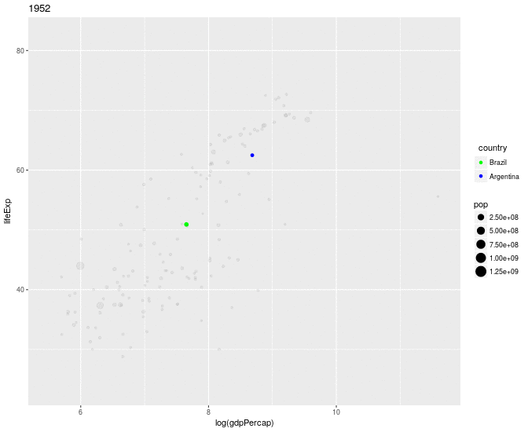

```{r, echo = FALSE}
knitr::opts_chunk$set(
  collapse = TRUE,
  comment = "#>",
  fig.path = "man/figures/README-"
)
```
#ggfocus

## Introduction

Many times during data analysis one may want to visualize data for a specific subgroup of observations. While ggplot is great for data visualization in general, constructing graphics that focus on those subgroups may need very troublesome manipulation of your data and graphical scales (for example colors), i.e. setting low alpha for unimportant observations, coloring things in a way that highlights the focus subgroup, etc.

**ggfocus** allows you to build graphics that focus on those specific subgroups doing the scale manipulation automatically while keeping all the flexibility from ggplot. The idea behind this approach is from [this](https://github.com/tidyverse/ggplot2/issues/2627) issue from tidyverse/ggplot2.


## Installing ggfocus

The package is not available in CRAN (yet), but you can install it from github with [devtools](https://github.com/hadley/devtools).

```{r install, eval=FALSE}
devtools::install_github("Freguglia/ggfocus")
```

## Usage 

*ggfocus* implements the *ggfocus()* function. (Read the function help for more information)

```{r gfocus, eval=FALSE}
ggfocus(p, var, focus_levels, focus_aes = c("color", "alpha"),
  color_focus = NULL, color_other = "black", alpha_focus = 1,
  alpha_other = 0.05)
```

- **p**: a ggplot.
- **var**: the factor that you want to specify some specific levels (note that this can be a numeric variable that represents a factor, i.e., you gave an integer number to each 'level' or a character variable).
- **focus_levels**: a vector of levels (either character or numeric) to highlight.
- **focus_aes**: which aesthetics should be used to highlight the levels. Currently only **color**, **alpha** and **fill** are available.
- **color_focus**: what color selected levels should have? It can be either one color (all equal) or character vector with one color for each level.
- **color_other**: color for levels not selected.
- **alpha_focus** and **alpha_other**: alpha for selcted and not selected levels, respectively.


## Examples

Using the *gapminder* dataset, first we create our ggplot
```{r ex1_create}
library(ggplot2)
library(gapminder)
p <- ggplot(gapminder, aes(x=log(gdpPercap), y=lifeExp, group=country)) + geom_line()
p
```

Now we can use *ggfocus()* to highlight European countries only.

```{r}
library(ggfocus)
ggfocus(p, continent, "Europe")
```

We can also highlight countries

```{r}
ggfocus(p, country, c("Brazil","Argentina"), color_focus = c("Green","Blue"))
```

### Interaction with other extensions
Because **ggfocus()** retuns a modified **ggplot** object, other ggplot extensions can used with it, for example, [gganimate](https://github.com/dgrtwo/gganimate).

```{r, eval=FALSE}
library(gganimate)
p <- ggplot(gapminder, aes(x=log(gdpPercap), y=lifeExp, size=pop, frame=year)) + geom_point()
focus_p <- ggfocus(p,country,c("Brazil","Argentina"), color_focus = c("Green","Blue"))
gganimate(focus_p,interval=.2)
```
```{r, out.width = "600px",echo=FALSE}

```

#### Using ggfocus with ggmaps

```{r}
library(ggmap)
library(maps)

wm <- map_data("world")
p <- ggplot(wm, aes(x=long, y = lat, group = group)) + geom_polygon(color="black") + theme_void()
ggfocus(p, region, c("Brazil","India","Italy","Canada"),focus_aes = c("fill","alpha"),
        color_focus = "blue", alpha_other = 0.15) + guides(fill=FALSE)
```

