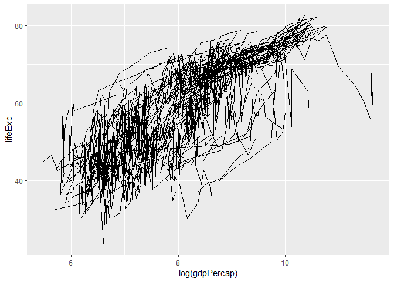
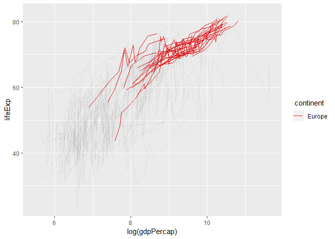
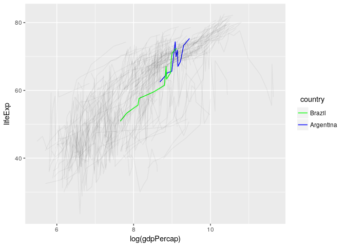
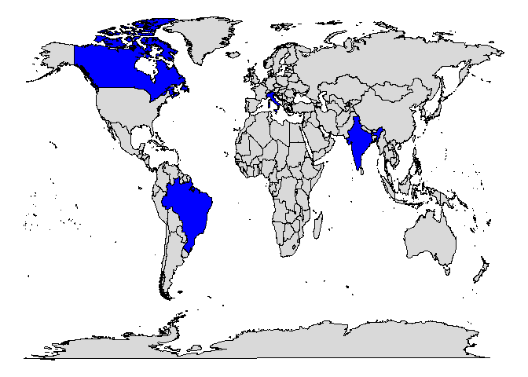

ggfocus 
=====================================================================

<!-- badges: start -->

<!-- badges: end -->

Introduction
------------

Many times during data analysis, one may want to visualize data for a
specific subgroup of observations. While ggplot is great for data
visualization in general, constructing graphics that focus on those
subgroups may need very troublesome manipulation of data and graphical
scales (for example colors), i.e. setting low alpha for unimportant
observations, coloring things in a way that highlights the focus
subgroup, etc.

**ggfocus** allows you to build graphics that focus on those specific
subgroups by doing the scale manipulation automatically while keeping
all the flexibility from ggplot. The idea behind this approach is from
[this](https://github.com/tidyverse/ggplot2/issues/2627) issue from
tidyverse/ggplot2.

Installing ggfocus
------------------

The package is available on CRAN, but you can also install the latest
version from github with [devtools](https://github.com/hadley/devtools).

    devtools::install_github("Freguglia/ggfocus") # Latest version
    install.packages("ggfocus") # CRAN version

Usage
-----

*ggfocus* implements the `ggfocus()` function.

    ggfocus(p, var, focus_levels, focus_aes = c("color", "alpha"),
      color_focus = NULL, color_other = "black", alpha_focus = 1,
      alpha_other = 0.05)

-   `p`: a ggplot.
-   `var`: the factor variable that you want to specify levels to focus
    (note that this can be a numeric variable that represents a factor,
    i.e., you gave an integer number to each ‘level’, like an integer ID
    or a character variable).
-   `focus_levels`: a vector of levels (either character or numeric) to
    highlight.
-   `focus_aes`: which aesthetics should be used to highlight the
    levels. Currently only `color`, `alpha` and `fill` are available. A
    character vector is expected.
-   `color_focus`: what color selected levels should have? It can be
    either one color (all equal) or character vector with one color for
    each level. This affects both `color` and `fill`.
-   `color_other`: color for levels not selected.
-   `alpha_focus` and `alpha_other`: alpha for selcted and not selected
    levels, respectively.

You can also use the usual `ggplot2` grammar `+` to add scales with the
family of function `scale_*_focus()`. These two uses are equivalent,
read the [vignette](vignettes/a-quick-guide-to-ggfocus.html) for more
information.

Examples
--------

In the `gapminder` dataset, first we create a simple `ggplot`

    library(ggplot2)
    library(gapminder)
    p <- ggplot(gapminder, aes(x=log(gdpPercap), y=lifeExp, group=country)) + geom_line()
    p

Now we can use *ggfocus()* to highlight European countries only.

    library(ggfocus)
    ggfocus(p, continent, "Europe")

We can also highlight countries

    ggfocus(p, country, c("Brazil","Argentina"), color_focus = c("Green","Blue"))

### Interaction with other extensions

Because `ggfocus()` retuns a modified `ggplot` object and only controls
scales, other `ggplot` extensions and types of graphics can interact
with it the same way, an example with `maps` is shown below.

    library(maps)

    wm <- map_data("world")
    p <- ggplot(wm, aes(x=long, y = lat, group = group)) + geom_polygon(color="black") + theme_void()
    ggfocus(p, region, c("Brazil","India","Italy","Canada"),focus_aes = c("fill","alpha"),
            color_focus = "blue", alpha_other = 0.15) + guides(fill=FALSE)

Contributing and Bug Reports
============================

-   If you find any unexpected result or bug, please file an issue with
    a reproducible example.
-   For new features, for example, the addition of the focus scale for a
    new aesthetics, file and issue and add and example or a brief
    explanation with important aspects for the focus scale of this new
    aesthetics.
-   If you want to contribute somehow, please contact me or file an
    issue so we can coordinate.
