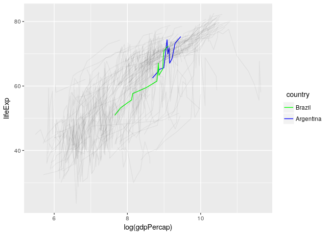
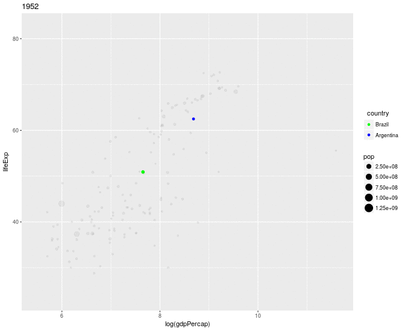
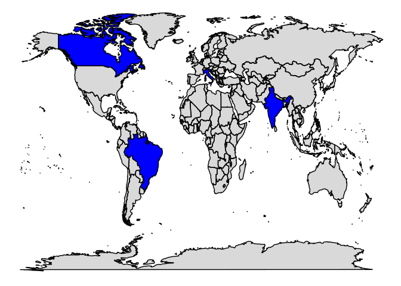

Introduction
------------

Many times during data analysis one may want to visualize data for a
specific subgroup of observations. While ggplot is great for data
visualization in general, constructing graphics that focus on those
subgroupd may need very troublesome manipulation of your data and
graphical scales (for example colors), i.e. setting low alpha for
unimportant observations, coloring things in a way that highlights the
focus subgroup, etc.

**ggfocus** allows you to build graphics that focus on those specific
subgroups doing the scale manipulation automatically while keeping all
the flexibility from ggplot.

Installing ggfocus
------------------

The package is not available in CRAN (yet), but you can install it from
github with [devtools](https://github.com/hadley/devtools).

    devtools::install_github("Freguglia/ggfocus")

Usage
-----

*ggfocus* implements the *ggfocus()* function. (Read the function help
for more information)

    ggfocus(p, var, focus_levels, focus_aes = c("color", "alpha"),
      color_focus = NULL, color_other = "black", alpha_focus = 1,
      alpha_other = 0.05)

-   **p**: a ggplot.
-   **var**: the factor that you want to specify some specific levels
    (note that this can be a numeric variable that represents a factor,
    i.e., you gave an integer number to each 'level' or a character
    variable).
-   **focus\_levels**: a vector of levels (either character or numeric)
    to highlight.
-   **focus\_aes**: which aesthetics should be used to highlight the
    levels. Currently only **color**, **alpha** and **fill** are
    available.
-   **color\_focus**: what color selected levels should have? It can be
    either one color (all equal) or character vector with one color for
    each level.
-   **color\_other**: color for levels not selected.
-   **alpha\_focus** and **alpha\_other**: alpha for selcted and not
    selected levels, respectively.

Examples
--------

Using the *gapminder* dataset, first we create our ggplot

    library(ggplot2)
    library(gapminder)
    p <- ggplot(gapminder, aes(x=log(gdpPercap), y=lifeExp, group=country)) + geom_line()
    p

Now we can use *ggfocus()* to highlight European countries only.

    library(ggfocus)
    ggfocus(p, continent, "Europe")

We can also highlight countries

    ggfocus(p, country, c("Brazil","Argentina"), color_focus = c("Green","Blue"))

Due to the high density of lines, we may want to reduce even more the
alpha for not selected countries (default it 0.15).

    ggfocus(p, country, c("Brazil","Argentina"), color_focus = c("Green","Blue"), alpha_other = 0.05)

### Interaction with other extensions

Because **ggfocus()** retuns a modified **ggplot** object, other ggplot
extensions can used with it, for example,
[gganimate](https://github.com/dgrtwo/gganimate).

    library(gganimate)
    p <- ggplot(gapminder, aes(x=log(gdpPercap), y=lifeExp, size=pop, frame=year)) + geom_point()
    focus_p <- ggfocus(p,country,c("Brazil","Argentina"), color_focus = c("Green","Blue"))
    gganimate(focus_p,interval=.2)

#### Using ggfocus with ggmaps

    library(ggmap)
    library(maps)

    wm <- map_data("world")
    p <- ggplot(wm, aes(x=long, y = lat, group = group)) + geom_polygon(color="black") + theme_void()
    ggfocus(p, region, c("Brazil","India","Italy","Canada"),focus_aes = c("fill","alpha"),
            color_focus = "blue", alpha_other = 0.15) + guides(fill=FALSE)

