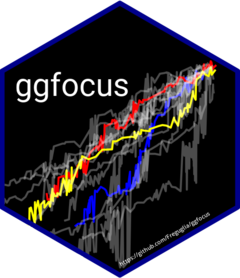

# ggfocus 

<!-- badges: start -->

[](https://github.com/Freguglia/ggfocus/actions/workflows/check-release.yaml)
[](https://cran.r-project.org/package=ggfocus)
<!-- badges: end -->

## Introduction

In data analysis, one may want to visualize data for a specific subgroup
of observations. Simply filtering out observations that do not belong to
the subgroup may take the information out of context. Therefore, it is
necessary to have tools that allow the analyst to draw attention (focus)
on that subgroup within the complete relevant information available.

While `ggplot2` is a great tool for data visualization in general,
constructing graphics that focus on those subgroups may need very
troublesome manipulation of data and graphical scales (for example
colors) together, i.e. setting low alpha for unimportant observations,
coloring things in a way that highlights the focused subgroup, etc.

`ggfocus` allows you to build graphics that focus on those specific
subgroups by doing the scale manipulation automatically while keeping
all the flexibility from `ggplot.` The idea behind this package is from
[this](https://github.com/tidyverse/ggplot2/issues/2627) issue from
`tidyverse/ggplot2`.

## Installing ggfocus

The package is available on CRAN, but you can also install the latest
version from Github with [devtools](https://github.com/hadley/devtools).

``` r
devtools::install_github("Freguglia/ggfocus") # Latest version
install.packages("ggfocus") # CRAN version
```

## Usage

The workflow of `ggfocus` is the same as any `ggplot` graphic with the
addition of the **focus scales** family of functions:

- `scale_color_focus(focus_levels, color_focus = NULL, color_other = "gray", palette_focus = "Set1")`
- `scale_fill_focus(focus_levels, color_focus = NULL, color_other = "gray", palette_focus = "Set1")`
- `scale_alpha_focus(focus_levels, alpha_focus = 1, alpha_other = .05)`
- `scale_linetype_focus(focus_levels, linetype_focus = 1, linetype_other = 3)`
- `scale_shape_focus(focus_levels, shape_focus = 8, shape_other = 1)`
- `scale_size_focus(focus_levels, size_focus = 3, size_other = 1)`

The user should map the variable with the grouping variable to all the
`aes` used to highlight observations and then use these functions to
automatically create scales that highlight a specified group of
observations.

Both the selected and unselected groups characteristics are customizable
with the parameters of focus scales. See the examples below.

## Examples

Creating an example dataset.

``` r
library(ggfocus)
set.seed(1)
# Create an example dataset
df <- data.frame(u1 = runif(300),
                 u2 = runif(300),
                 grp = sample(LETTERS[1:10], 300, replace = TRUE))
head(df)
#>          u1         u2 grp
#> 1 0.2655087 0.67371223   C
#> 2 0.3721239 0.09485786   E
#> 3 0.5728534 0.49259612   B
#> 4 0.9082078 0.46155184   E
#> 5 0.2016819 0.37521653   E
#> 6 0.8983897 0.99109922   C
```

Suppose that we are mainly interested in groups `A` and `B`, but we do
not want to lose the `u1` and `u2` information from other groups.
Visualizing with focus on observations such that `grp` is `A` or `B` is
shown below.

``` r
# Default scales
ggplot(df, aes(x = u1, y = u2, color = grp)) +
  geom_point() +
  ggtitle("Standard Scales")
```


``` r

# Focus scales
ggplot(df, aes(x = u1, y = u2, color = grp, alpha = grp)) +
  geom_point() +
  scale_color_focus(c("A", "B"), color_focus = c("blue", "red")) +
  scale_alpha_focus(c("A", "B")) +
  ggtitle("Focus Scales")
```


### Interaction with other extensions

Since `ggfocus` creates the focused visualization solely by controlling
scales, other `ggplot` extensions and types of graphics can interact
with it the same way, an example with the `maps` package is shown below.

``` r
library(maps)
wm <- map_data("world")
ggplot(wm, aes(x = long, y = lat, group = group, fill = region)) +
  geom_polygon(color = "black") +
  theme_void() +
  scale_fill_focus(c("Brazil", "Canada", "Australia", "India"),
                   color_other = "gray")
```

<!-- -->
